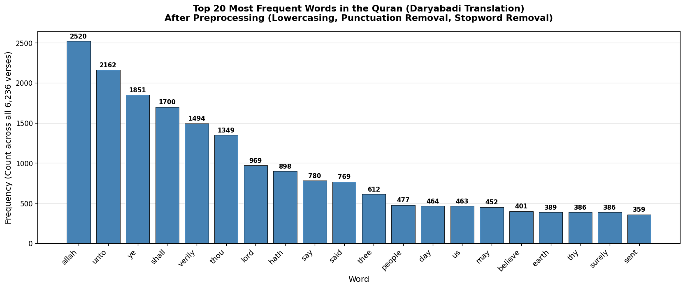

# NB01 — Text Preprocessing and Bag-of-Words

[Open in GitHub](https://github.com/haqnawaz99/bow-embeddings/blob/main/Claude/NB01_Text_Preprocessing_and_BoW.ipynb){ .md-button }

---

## What this notebook covers

The starting point of the entire series. You will build a complete text preprocessing pipeline from scratch, then use it to create a Bag-of-Words representation and your first working search engine.

## What the previous approach got wrong

This is notebook one — there is no previous approach. This is where we define the baseline that all future notebooks will improve on.

## Key concept

**Bag-of-Words**: represent a document as a count of how many times each word appears. Ignore word order, grammar, and meaning — just count.

```python
from sklearn.feature_extraction.text import CountVectorizer

vectorizer = CountVectorizer()
X = vectorizer.fit_transform(corpus)
```

## Topics covered

- Lowercasing and punctuation removal
- Tokenization with NLTK `word_tokenize`
- Stopword removal
- Porter stemming
- `CountVectorizer` — vocabulary and document-term matrix
- Cosine similarity search
- BoW limitations: "not bad" ≠ "good", word order blindness

## Output

Top 20 most frequent words across the corpus after preprocessing:



## Limitation this notebook reveals

BoW treats every word as equally important. "the" and "mercy" get the same weight. A document that mentions "the" 50 times scores higher than one that mentions "compassion" once — even if the query is about compassion.

That is the problem TF-IDF solves in NB02.

## Reflection questions

1. Why does removing stopwords improve search quality for most queries?
2. What does cosine similarity measure that Euclidean distance does not?
3. The "not bad / not good" demo fails. Why can't BoW detect negation?
4. Stemming reduces "mercy" and "merciful" to the same root. Is that always a good thing?
5. If you doubled every document in the corpus, how would cosine similarity scores change?
