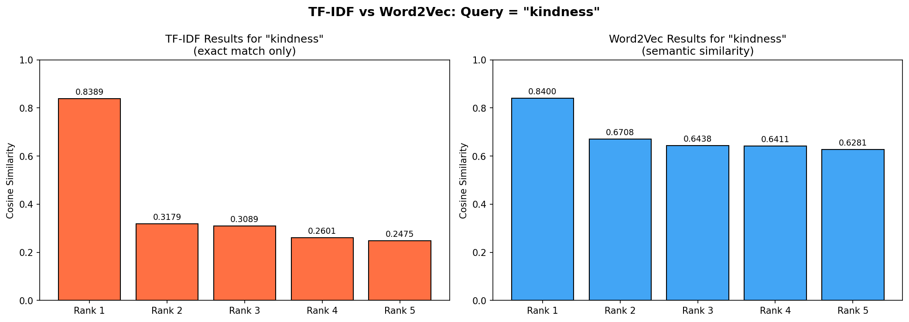

# NB02 — TF-IDF and Ranked Retrieval

[Open in GitHub](https://github.com/haqnawaz99/bow-embeddings/blob/main/Claude/NB02_TF_IDF_and_Ranked_Retrieval.ipynb){ .md-button }

---

## The Problem with Equal Weighting

BoW treats every word with equal importance. In the Quran corpus, the word "allah" appears in 2,500+ verses. The word "camel" appears in about 12. BoW assigns them the same weight: 1 count = 1 count.

This means a verse saying *"Allah is great, Allah is merciful, Allah is kind"* scores highly for almost **every query** — not because it is relevant, but because it contains a word that is everywhere.

| Word | Frequency across corpus | How distinctive is it? |
|---|---|---|
| `allah` | 2,500+ verses | Very low — it's everywhere |
| `mercy` | ~300 verses | Moderate |
| `resurrection` | ~80 verses | High — genuinely distinctive |
| `camel` | ~12 verses | Very high — rare topic |

TF-IDF fixes this by rewarding words that are frequent *in this document* but rare *across the corpus*.

---

## TF-IDF Theory

### Term Frequency (TF)

How often does word `t` appear in document `d`, normalized by document length?

```
TF(t, d) = count(t in d) / total words in d
```

**Why normalize?** A 50-word verse and a 5-word verse with the same word once should be comparable. Dividing by length makes TF comparable across documents.

**Example:** Verse has 20 words. "mercy" appears 2 times.
```
TF(mercy, d) = 2/20 = 0.10
```

### Inverse Document Frequency (IDF)

How rare is word `t` across the entire corpus of `N` documents?

```
IDF(t) = log( N / df(t) )
```

Where `df(t)` = number of documents containing term `t`.

**Why the logarithm?** Without it, the ratio would be linear. Log compresses the scale so the difference between "appears in 1 doc" and "appears in 10 docs" is comparable to "appears in 100 docs" vs "appears in 1,000 docs".

**Intuition in practice:**
```
"allah"       appears in ~2,800 verses → IDF = log(6236/2800) ≈ 0.80  (LOW)
"resurrection" appears in ~80 verses   → IDF = log(6236/80)  ≈ 4.36  (HIGH)
"camel"       appears in ~12 verses    → IDF = log(6236/12)  ≈ 6.35  (VERY HIGH)
```

### TF-IDF Score

```
TF-IDF(t, d) = TF(t, d) × IDF(t)
```

A word gets a **high TF-IDF score** when it appears frequently in *this* document AND is rare across the corpus. A common word like "allah" is penalized by its near-zero IDF even if it appears many times.

---

## Worked Example

```
Corpus (N = 3 documents):
  d1: "allah is merciful and allah is kind"
  d2: "the day of resurrection is near"
  d3: "allah will raise the dead on the day of resurrection"

Document frequencies:
  allah        → 2 docs  → IDF = log(3/2) = 0.405
  merciful     → 1 doc   → IDF = log(3/1) = 1.099
  resurrection → 2 docs  → IDF = log(3/2) = 0.405

TF for d1 (tokens after stopword removal: allah, merciful, allah, kind = 4 tokens):
  allah    → 2/4 = 0.500 → TF-IDF = 0.500 × 0.405 = 0.203
  merciful → 1/4 = 0.250 → TF-IDF = 0.250 × 1.099 = 0.275
```

Even though "allah" appears **twice** and "merciful" only **once**, their TF-IDF scores are almost equal — because "allah" is penalized by its low IDF.

---

## Weighting Intuition

```
Word frequency in THIS document (TF)
  |
  | ** "allah"      TF=high, IDF=low  → TF-IDF MEDIUM/LOW
  | **  "merciful"  TF=low,  IDF=high → TF-IDF MEDIUM/HIGH
  |  *  "camel"     TF=low,  IDF=very high → TF-IDF HIGH
  +-------------------------------------------------------->
                  Rarity across corpus (IDF)

The WINNER is a word that is moderately frequent here
AND rare everywhere else.
```

---

## scikit-learn Parameters

| Parameter | Value | Meaning |
|---|---|---|
| `min_df` | 2 | Ignore words in fewer than 2 documents |
| `max_features` | 5000 | Keep top 5,000 terms |
| `smooth_idf` | True | IDF = log((1+N)/(1+df)) + 1. Prevents division by zero |
| `sublinear_tf` | True | Use log(1 + TF) — dampens very high term counts |
| `norm` | 'l2' | L2-normalize rows so dot product = cosine similarity |

### Why `sublinear_tf`?

Without it, 100 occurrences scores 10× higher than 10 occurrences. Is a document really 10× more relevant? Probably not. `sublinear_tf=True` uses log(1 + count):
```
count=1   → log(2)  = 0.69
count=2   → log(3)  = 1.10  (not 2×)
count=10  → log(11) = 2.40  (not 10×)
```

---

## Output

Rank drift scatter plot — how each document's ranking changes when switching from BoW to TF-IDF. Documents that move up gained from rare-word boosting; those that drop were inflated by common words.



---

## Limitations

**1. No Semantic Understanding**
"kindness" and "mercy" are completely unrelated in TF-IDF space — they share no characters, so they share no score.

**2. No Word Order**
"Allah forgives the believers" and "The believers forgive Allah" produce identical TF-IDF vectors.

**3. Sparsity**
The TF-IDF matrix is still ~99% zeros — same structural problem as BoW.

**4. Corpus Bias in IDF**
IDF depends entirely on what other documents are in the collection. "allah" has a low IDF in this Quran corpus but would have a much higher IDF if mixed with Wikipedia.

**5. Vocabulary Mismatch**
Out-of-vocabulary words are silently ignored. If a user queries a word filtered by `min_df`, TF-IDF returns nothing for that term.

---

## Reflection Questions

1. "allah" receives a LOW TF-IDF score despite being theologically central. Why? What does IDF measure?
2. If we combined the Quran with 1 million news articles, how would the IDF of "allah", "president", and "resurrection" change?
3. `sublinear_tf=True` uses log(1+tf). Does this dampen the difference between counting 2 vs 10 times? Is that desirable?
4. Find a query where TF-IDF clearly outperforms BoW. Why does it win for that specific query?
5. List three things TF-IDF still cannot do. For each, explain how word embeddings (NB04) would address it.

---

**Next:** [NB03 — N-Grams and Context](nb03.md) — capture word sequences
