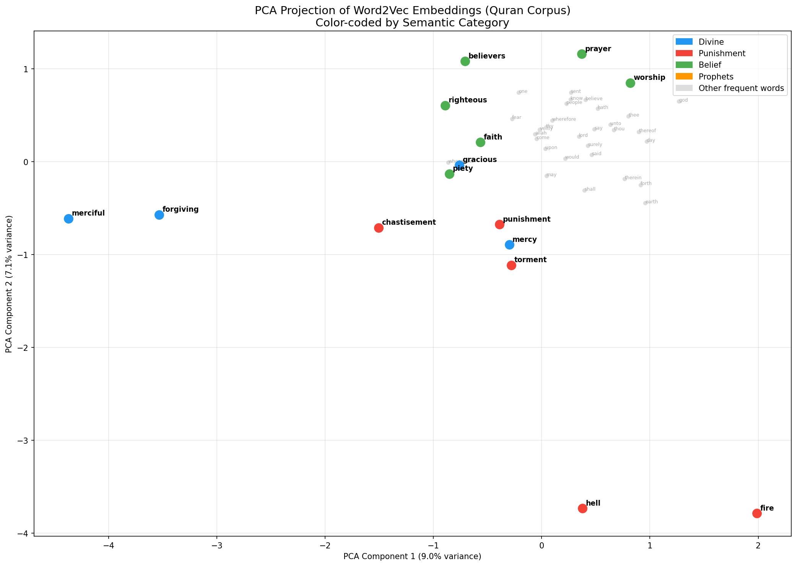
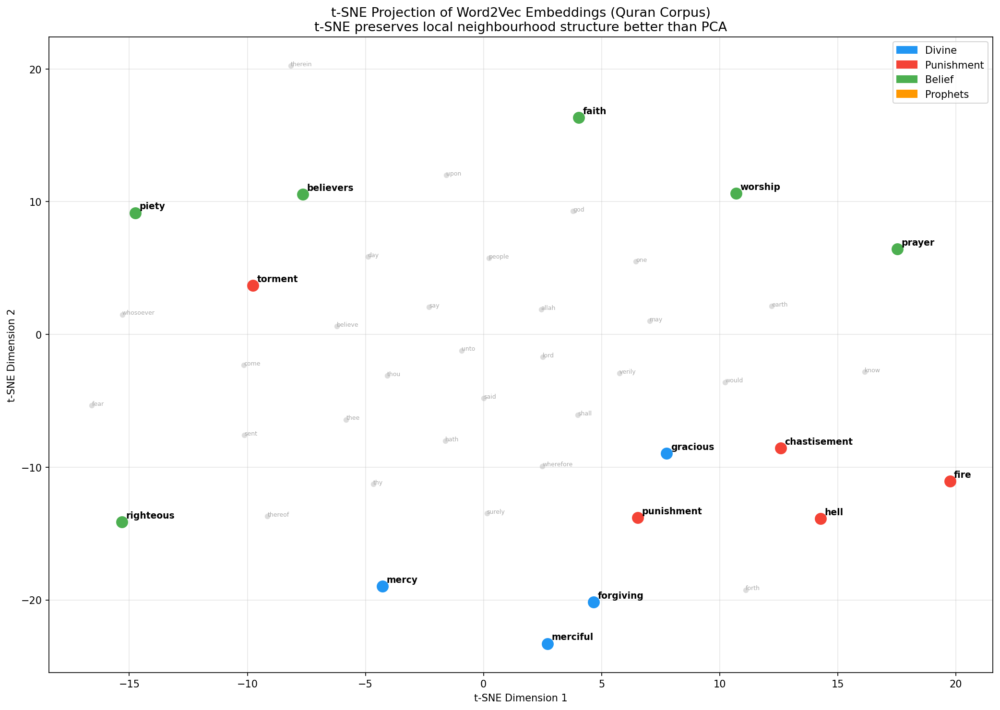

# NB04 — Word2Vec Embeddings

[Open in GitHub](https://github.com/haqnawaz99/bow-embeddings/blob/main/Claude/NB04_Word2Vec_Embeddings.ipynb){ .md-button }
[Concepts: Embeddings](../concepts/embeddings.md){ .md-button .md-button--secondary }

---

## Why Embeddings?

The methods we have studied so far — BoW, TF-IDF, N-Grams — all produce **sparse** vectors. In a vocabulary of 5,000 words, each document is a 5,000-dimensional vector with 99%+ zeros.

This creates deep problems:

```
Sparse representation of "mercy":
[0, 0, 0, 0, 1, 0, 0, 0, 0, 0, 0, 0, ...]
                ↑ one non-zero value
         in 5,000 dimensions

Sparse representation of "kindness":
[0, 0, 0, 0, 0, 0, 0, 1, 0, 0, 0, 0, ...]
                         ↑ different dimension

cosine("mercy", "kindness") = 0  ← completely unrelated!
```

Dense embeddings fix this. In a 100-dimensional Word2Vec space:
```
cosine("mercy", "kindness")   = 0.76
cosine("mercy", "compassion") = 0.81
cosine("mercy", "elephant")   = 0.08
```

---

## The Distributional Hypothesis

> *"You shall know a word by the company it keeps."* — J.R. Firth, 1957

Words that appear in similar contexts tend to have similar meanings. "mercy" and "compassion" both appear near words like "forgive", "kind", "heart", "believers". This co-occurrence signal is what Word2Vec learns from.

---

## Word2Vec Architecture

Word2Vec trains a shallow neural network on a prediction task. There are two architectures:

### CBOW — Continuous Bag of Words

**Task:** Given the surrounding words, predict the centre word.

```
Context words:    ["Allah", "is", ___, "merciful"]
Predict:          "most"
```

CBOW is faster and works well with large datasets and frequent words.

### Skip-Gram

**Task:** Given the centre word, predict the surrounding words.

```
Centre word:      "merciful"
Predict:          ["Allah", "is", "most", "and"]
```

Skip-Gram works better for small datasets and rare words — it generates more training examples per word.

### Why this works

The model never directly tries to learn what words mean. But to solve the prediction task, it must learn that words used in similar contexts are similar. The network weights, after training, **are** the word embeddings.

### The embedding space

After training on the Quran corpus, Word2Vec produces:
- One 100-dimensional vector per word
- Similar words → nearby vectors
- Relationships encoded as directions in space

---

## Analogy Arithmetic

A remarkable property: semantic relationships become vector arithmetic.

```
king  - man  + woman ≈ queen
Paris - France + Germany ≈ Berlin
mercy - forgiveness + punishment ≈ wrath (approximately)
```

The vector from "man" to "woman" encodes the gender relationship. Applying that same offset to "king" gives "queen". Meaning is geometry.

---

## Training Configuration

```python
from gensim.models import Word2Vec

W2V_KW = dict(
    vector_size = 100,  # embedding dimensions
    window      = 5,    # context window size
    min_count   = 2,    # ignore words appearing fewer than 2 times
    workers     = 4,    # parallel training threads
    seed        = 42,   # reproducibility
)

# CBOW (sg=0)
cbow = Word2Vec(sentences, sg=0, **W2V_KW)

# Skip-Gram (sg=1)
skipgram = Word2Vec(sentences, sg=1, **W2V_KW)
```

---

## Visualising the Embedding Space

### PCA — Principal Component Analysis

PCA finds the two directions of maximum variance in the 100-dimensional space and projects everything onto a 2D plane. It is a linear transformation — clusters that are real in high dimensions remain visible.



### t-SNE — t-Distributed Stochastic Neighbour Embedding

t-SNE is a non-linear dimensionality reduction. It preserves **local structure** — words that are close in high dimensions stay close in 2D. Better for visualising clusters than PCA.



---

## Document Embeddings for Search

Word2Vec produces word vectors. To search over documents, we need document vectors. Three strategies:

| Strategy | Method | Quality |
|---|---|---|
| **Mean pooling** | Average all word vectors in the document | Fast, reasonable quality |
| **TF-IDF weighted** | Weight each word vector by its TF-IDF score before averaging | Better — weights important words more |
| **Max pooling** | Take the maximum value in each dimension across all word vectors | Captures strongest signals |

Mean pooling is the standard approach for Word2Vec-based document retrieval.

---

## Word2Vec vs TF-IDF Comparison

Running the same query through TF-IDF and Word2Vec:

- **TF-IDF** returns verses that contain the exact query words (or their stems)
- **Word2Vec** returns verses that are *semantically similar* — may have no shared words

For the query "kindness and care":
- TF-IDF: returns verses containing the literal words "kindness" and "care"
- Word2Vec: returns verses about mercy, compassion, tenderness — even if those words don't overlap


---

## Limitations

**1. Polysemy — One Word, One Vector**
"bank" gets one vector regardless of context. Word2Vec cannot distinguish "river bank" from "financial bank". This is a fundamental architectural limitation.

**2. No Sentence-Level Understanding**
To represent a sentence you average word vectors — but averaging destroys word order, negation, and composition. "dog bites man" and "man bites dog" produce the same mean vector.

**3. Requires Training from Scratch**
Word2Vec trains on your corpus only. With 6,236 verses, the vocabulary is limited. Pre-trained models (GloVe, fastText) trained on billions of words would give better vectors — but require a much larger dataset.

**4. OOV Words**
If a word was not seen during training, Word2Vec has no vector for it. Any unseen word causes a `KeyError` at query time.

**5. Averaging Destroys Compositionality**
"not good" and "not bad" produce similar averaged vectors even though they have opposite meanings.

---

## Reflection Questions

1. CBOW and Skip-Gram train on inverse tasks. Which performs better on rare words, and why?
2. PCA explained variance drops off after the first two components. What does this tell you about the intrinsic dimensionality of the word space?
3. The analogy `king - man + woman = queen` works. Why does `Paris - France + Germany` not always give `Berlin`?
4. If you trained Word2Vec on a general English corpus (Wikipedia) instead of the Quran, how would the vector for "verse" change?
5. Averaging word vectors to represent a sentence loses word order. Design an experiment to show when this causes retrieval to fail.

---

**Next:** [NB05 — FastText and Subword Embeddings](nb05.md) — fix the OOV problem
