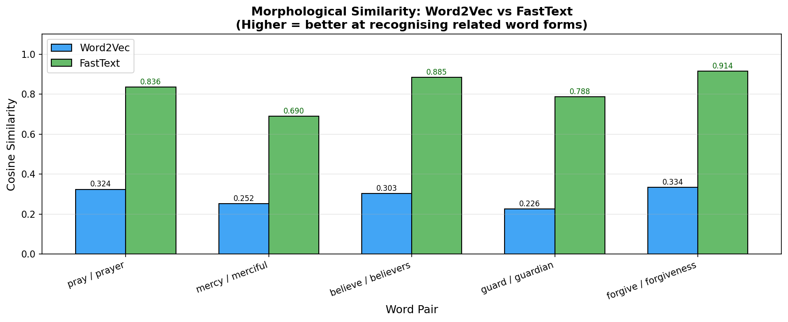
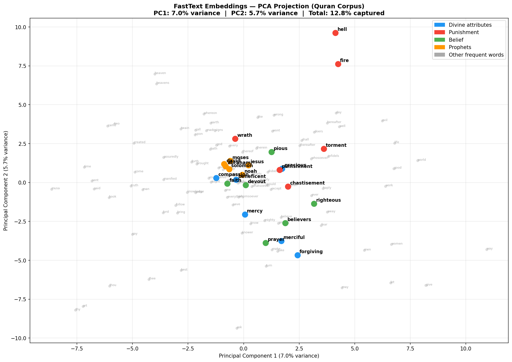
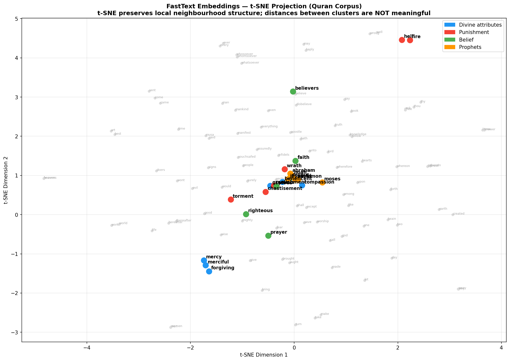

# NB05 — FastText and Subword Embeddings

[Open in GitHub](https://github.com/haqnawaz99/bow-embeddings/blob/main/Claude/NB05_FastText_and_Subword_Embeddings.ipynb){ .md-button }

---

## Word2Vec's Two Failures

In NB04, Word2Vec gave us a major leap: dense, semantic word vectors. But Word2Vec has two deep architectural flaws:

### Failure 1 — OOV Words
If a word was not seen during training, Word2Vec has no vector for it. Querying with a misspelling, a rare theological term, or any unseen word causes a `KeyError`. The model is completely blind to unknown tokens.

### Failure 2 — Morphology Blindness
Word2Vec treats every word form as an independent atom. "pray", "praying", "prayed", "prayer" are four completely separate vocabulary entries — no shared information. The model learns each from scratch, even though they share the same root and meaning.

FastText solves both with a single idea: **character n-grams**.

---

## What is FastText?

FastText (Facebook AI, 2016) extends Word2Vec by representing each word as a **sum of its character n-gram vectors**.

For the word "merciful" with n-gram range (3,6):

```
"merciful" decomposes into:
  <me, mer, erc, rci, cif, ifu, ful, ul>   (3-grams)
  <mer, erci, rcif, cifu, iful, ful>        (4-grams)
  <merci, ercif, rcifu, ciful>              (5-grams)
  <mercif, ercifu, rciful>                  (6-grams)
  + the whole word token <merciful>

Final vector = sum of all character n-gram vectors
```

The `<` and `>` markers are boundary markers that distinguish "her" as a standalone word from "her" inside "there".

---

## Why Character N-Grams Solve Both Problems

**OOV words:**
```python
# Word2Vec - crashes
word2vec["zzzmercylikezzz"]  # KeyError!

# FastText - works
fasttext["zzzmercylikezzz"]
# → constructed from character n-grams:
#   <zz, zzm, zzme, zzmercylikezzz, ...>
#   Some overlap with known words → reasonable approximation
```

**Morphological variants:**
```
"pray"     → shares <pra, ray, ...> with "praying", "prayer"
"praying"  → shares <pra, ray, yin, ing> with "pray", "prayer"
"prayer"   → shares <pra, ray, aye, yer> with "pray", "praying"
```

All three words share character n-grams → their vectors are related by construction, not just learned from co-occurrence.

---

## Training Configuration

```python
from gensim.models import FastText

FT_KW = dict(
    vector_size = 100,
    window      = 5,
    min_count   = 2,
    workers     = 4,
    seed        = 42,
    min_n       = 3,          # minimum character n-gram length
    max_n       = 6,          # maximum character n-gram length
    bucket      = 2_000_000,  # hash table size for n-gram storage
)

ft = FastText(sentences, **FT_KW)
```

The `bucket` parameter controls how many hash buckets store character n-gram vectors. Too small → hash collisions, lower quality. The default of 2 million is appropriate for most corpora.

---

## OOV Handling Demo

```python
# A completely invented word
oov_word = "zzzmercylikezzz"

# Word2Vec - fails
try:
    word2vec.wv[oov_word]
except KeyError:
    print("Word2Vec: KeyError - word not in vocabulary")

# FastText - succeeds
vec = ft.wv[oov_word]
similar = ft.wv.most_similar(oov_word, topn=5)
# Returns words related to mercy/kindness — the character n-grams overlap
```

---

## Morphology Comparison

For a word like "merciful", Word2Vec and FastText give different most-similar results:

**Word2Vec** — learns from co-occurrence only:
```
most_similar("merciful"):
  "gracious" (0.82)
  "compassionate" (0.79)
  "beneficent" (0.77)
```

**FastText** — additionally captures character overlap:
```
most_similar("merciful"):
  "mercifully" (0.91)   ← character overlap
  "mercy" (0.88)        ← character overlap
  "gracious" (0.79)
```

FastText finds morphological relatives ("mercifully", "mercy") that Word2Vec misses — they share the same root characters.

---

## Outputs

**Word2Vec vs FastText morphology comparison:**



**FastText embedding space (PCA):**



**FastText embedding space (t-SNE):**



---

## L2 Norm Diagnostic

After training, we plot the L2 norm (vector length) for the most frequent words. In a healthy embedding space, norms should be reasonably uniform — very long vectors suggest a word dominates the training objective, very short ones suggest insufficient training examples.

---

## Limitations

**1. Still one vector per word (polysemy)**
FastText still produces one vector per word form. "bank" (river) and "bank" (finance) share the same vector. Character n-grams help with morphology but not with polysemy.

**2. N-grams help morphology, not semantics**
"merciful" shares characters with "mercy" — but "compassion" and "mercy" share no characters. Semantic similarity still comes from co-occurrence, not character overlap.

**3. No sentence-level understanding**
Still averaging word vectors to represent sentences. The same fundamental limitation as Word2Vec.

**4. Requires training from scratch**
Training on a small corpus of 6,236 verses limits vocabulary quality compared to pre-trained models.

### Limitation to Next Step

| Limitation | Solution | Notebook |
|---|---|---|
| No sentence-level embedding | Train on sentence pairs | NB06 |
| Polysemy (one vector per word) | Contextual embeddings (BERT/SBERT) | NB06 |
| Brute-force search at scale | Vector index (FAISS) | NB07 |
| Passages not answers | RAG pipeline | NB08 |

---

## Reflection Questions

1. FastText handles OOV words. Can it handle OOV words in a completely different script (e.g. Arabic in an English-trained model)? Why or why not?
2. The `bucket` parameter controls hash table size for character n-grams. What happens if `bucket` is too small?
3. A word with a typo ("recieve" vs "receive") — would FastText handle this better than Word2Vec? Explain why using the subword mechanism.
4. The L2 norm diagnostic shows some word vectors are much longer than others. What does a very long vector imply about that word's representation?
5. FastText subword training is slower than Word2Vec. In what production scenarios would that overhead be worth it?

---

**Next:** [NB06 — Sentence Embeddings and Semantic Search](nb06.md) — one vector per sentence
