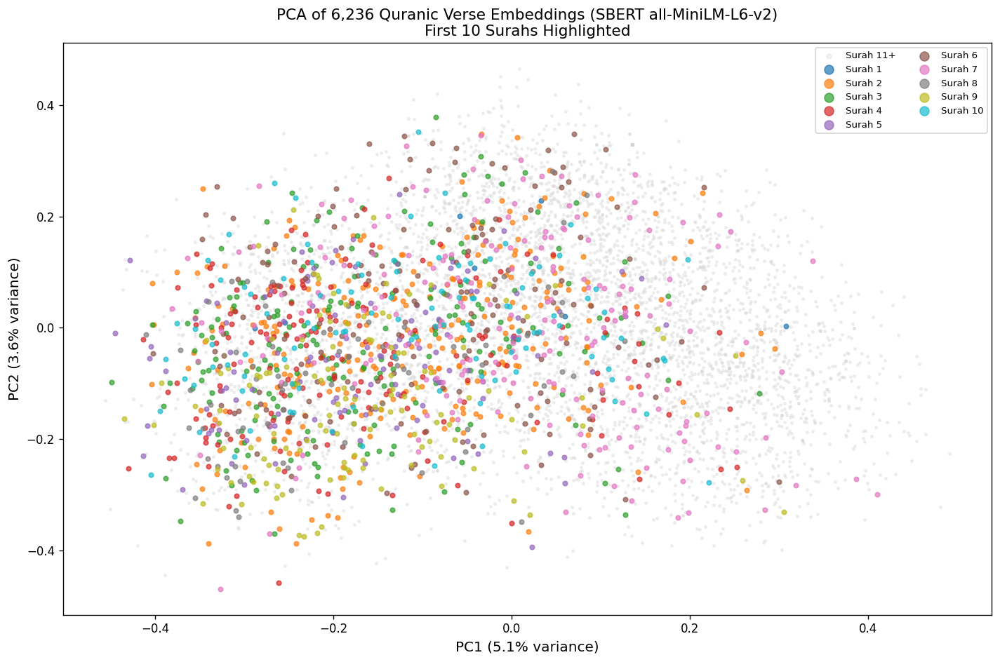
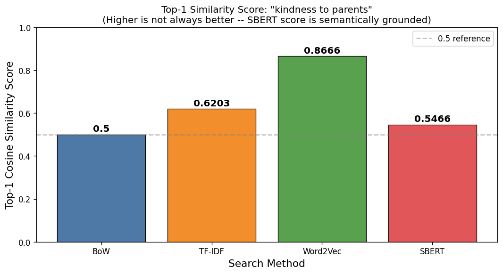

# NB06 — Sentence Embeddings and Semantic Search

[Open in GitHub](https://github.com/haqnawaz99/bow-embeddings/blob/main/Claude/NB06_Sentence_Embeddings_and_Semantic_Search.ipynb){ .md-button }

---

## What this notebook covers

Sentence embeddings encode an entire sentence into a single dense vector using a pre-trained transformer model (SBERT). Unlike averaged word vectors, these representations capture sentence-level meaning, grammar, and context. You will build a semantic search engine that finds passages by meaning, not keywords.

## What the previous approach got wrong

Word2Vec and FastText produce one vector per word. To represent a sentence you average the word vectors — but averaging destroys word order, negation, and contextual meaning. "The dog bit the man" and "The man bit the dog" produce identical averaged vectors.

## Key concept

**SBERT (Sentence-BERT)**: a transformer model fine-tuned specifically to produce semantically meaningful sentence embeddings. Similar sentences map to nearby points in the 384-dimensional embedding space — even if they share no words.

```python
from sentence_transformers import SentenceTransformer

model = SentenceTransformer("all-MiniLM-L6-v2")
embeddings = model.encode(sentences, normalize_embeddings=True)
```

## Topics covered

- `all-MiniLM-L6-v2` — 384-dimensional sentence encoder
- `MAX_VERSES` config for controlling index size
- L2 normalisation: why `normalize_embeddings=True` matters
- Cosine similarity semantic search
- Similarity score histogram — distribution of all pairwise scores
- Top-5 overlap analysis: SBERT vs TF-IDF on the same queries
- When semantic search wins; when keyword search wins

## Outputs

**Sentence embedding PCA** — 2D projection of the full corpus embedding space. Semantic clusters are visible even at this resolution:



**SBERT vs TF-IDF comparison chart** — overlap between the top-5 results from each method on the same queries:



## Limitation this notebook reveals

Cosine similarity over all 6,000+ vectors is a brute-force operation — it gets slower linearly as the corpus grows. At 100,000 documents it is slow. At 10 million documents it is unusable. You need an index structure that makes nearest-neighbour search fast.

That is what FAISS solves in NB07.

## Reflection questions

1. SBERT finds "compassion" when you query "mercy" because both map to nearby vectors. How is this different from a synonym dictionary?
2. Why does `normalize_embeddings=True` allow you to use dot product instead of cosine similarity?
3. The similarity histogram shows most pairs score between 0.1 and 0.4. What does a bimodal histogram (two peaks) in this plot tell you?
4. TF-IDF outperforms SBERT on exact-keyword queries. Why? Design a query where you would deliberately choose TF-IDF over SBERT.
5. `all-MiniLM-L6-v2` is a 22M parameter model. How do you think its representations would differ from a 7B parameter LLM used as an encoder?
