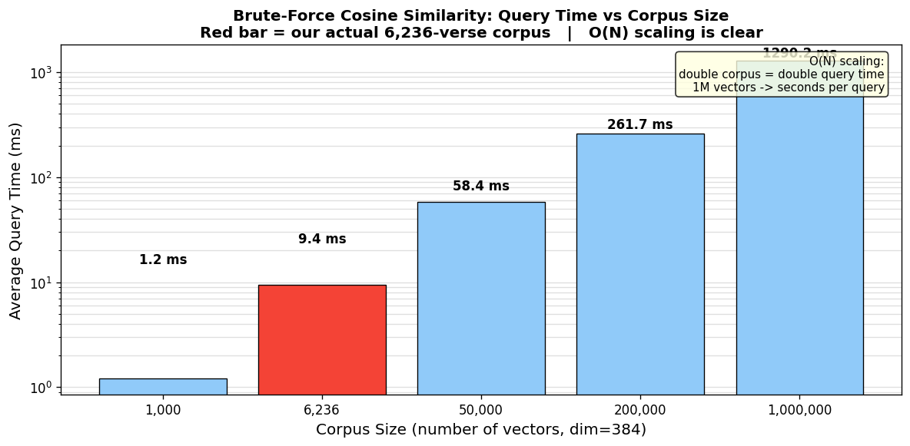
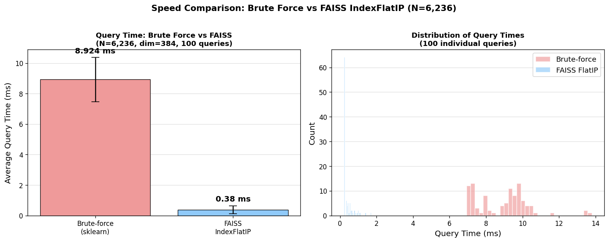
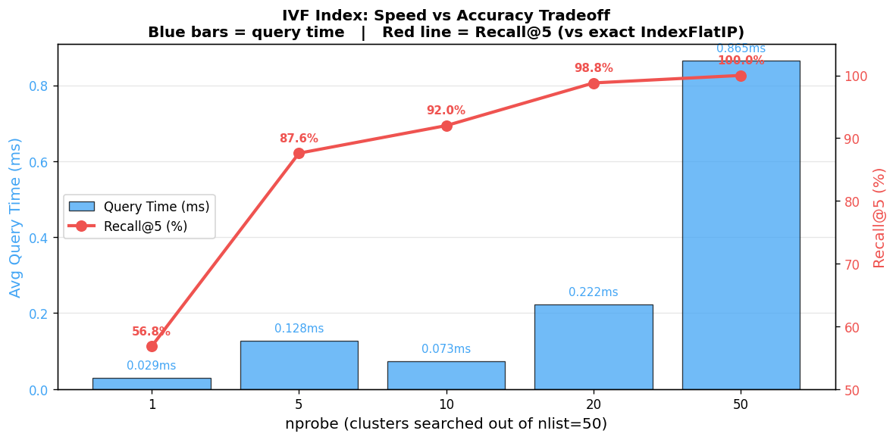

# NB07 — Vector Databases and FAISS

[Open in GitHub](https://github.com/haqnawaz99/bow-embeddings/blob/main/Claude/NB07_Vector_Databases_and_FAISS.ipynb){ .md-button }

---

## What this notebook covers

FAISS (Facebook AI Similarity Search) is a library for efficient nearest-neighbour search over large vector collections. You will build an exact flat index, an approximate IVF index, sweep nprobe values, measure recall@K, and wrap everything into a reusable `QuranSearchEngine` class.

## What the previous approach got wrong

Brute-force cosine similarity over all vectors works fine for thousands of documents but becomes unusably slow at scale. Every query requires a full pass over the entire corpus. FAISS replaces this with index structures that answer queries orders of magnitude faster.

## Key concept

**IndexFlatIP** — exact inner-product search. No approximation, guaranteed correct results, but scales linearly with corpus size.

**IndexIVFFlat** — approximate search. Partitions the space into `nlist` Voronoi cells, searches only `nprobe` cells at query time. Trading a small amount of recall for large speed gains.

```python
import faiss

# Exact search
index_flat = faiss.IndexFlatIP(d)
index_flat.add(embeddings)

# Approximate search
quantiser = faiss.IndexFlatIP(d)
index_ivf = faiss.IndexIVFFlat(quantiser, d, nlist=50)
index_ivf.train(embeddings)
index_ivf.add(embeddings)
index_ivf.nprobe = 8  # search 8 cells per query
```

## Topics covered

- `IndexFlatIP` vs brute-force sklearn — speed comparison (80-rep averaged timing)
- `IndexIVFFlat` — training, `nlist`, `nprobe`
- nprobe sweep: recall@K at nprobe = 1, 4, 16, 32
- `np.ascontiguousarray()` — why FAISS needs C-contiguous memory
- Save and load index to disk
- `QuranSearchEngine` class — metadata filtering, reusable API
- Metadata filtering workaround (FAISS does not store metadata natively)

## Outputs

**Brute-force scaling** — how search time grows with corpus size for brute-force vs FAISS flat:



**Speed comparison — flat index** — averaged timing across 80 repetitions:



**IVF speed vs accuracy** — nprobe sweep showing the recall@K / speed tradeoff:



## Limitation this notebook reveals

FAISS returns passages — ranked lists of relevant text. But a user asking a question does not want a list of passages; they want an answer. Retrieval and generation need to be connected.

That connection is RAG, built in NB08.

## Reflection questions

1. recall@K = 0.34 at nprobe=1 means FAISS missed 66% of the true top-K results. Why would you ever use nprobe=1 in production?
2. `IndexIVFFlat` requires training before adding vectors. What does training do, and why does `IndexFlatIP` not need it?
3. FAISS `IndexFlatIP` uses inner product, not cosine similarity. Why do we normalise vectors before adding them?
4. You save the FAISS index to disk but not the DataFrame of metadata. What are the risks of loading an index without its corresponding metadata?
5. The `QuranSearchEngine` class stores metadata in a Python dict alongside the FAISS index. What would break if documents were added to the index after the class was initialised?
